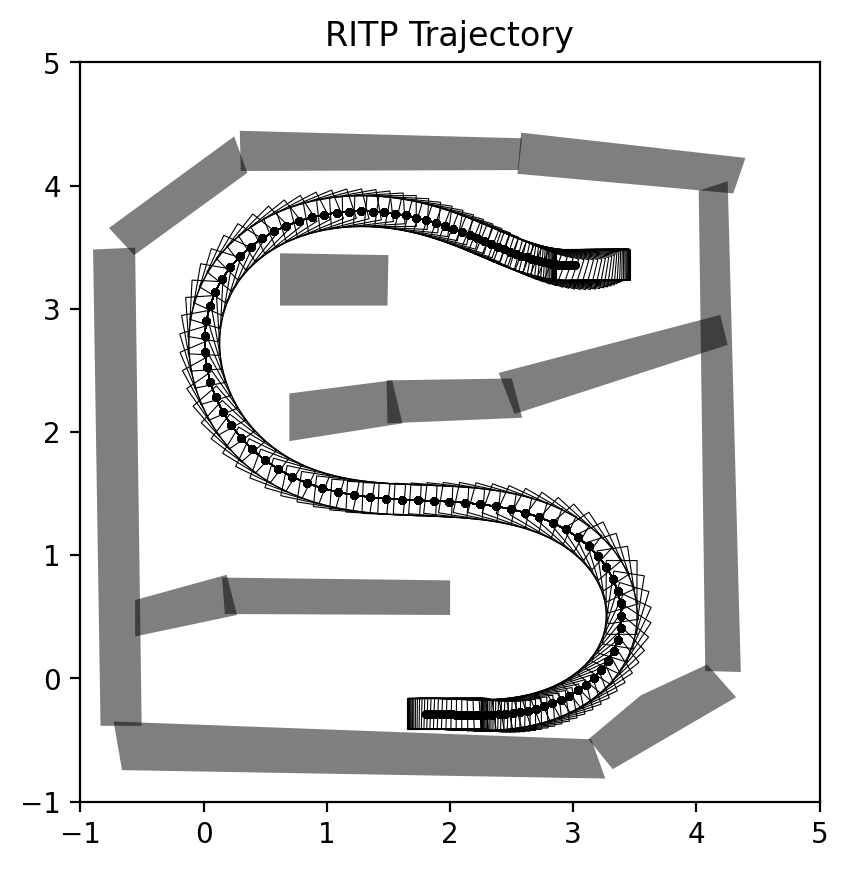
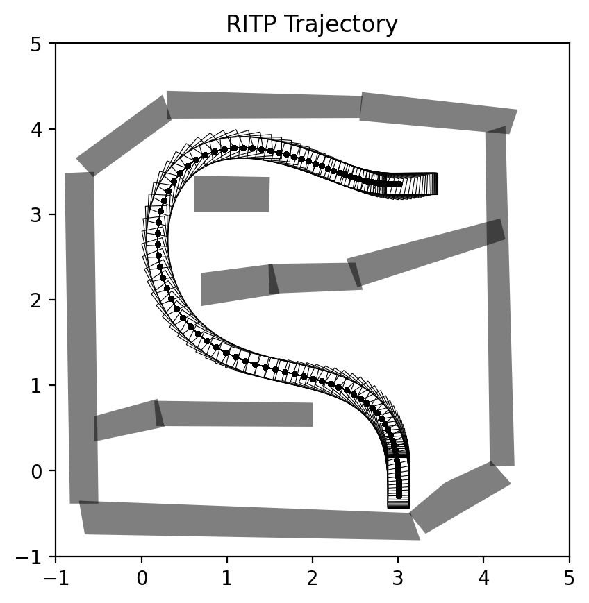

# A rapid iterative trajectory planning method

Deploy and visualize the trajectory planner in paper "[A rapid iterative trajectory planning method for automated parking through differential flatness](https://www.sciencedirect.com/science/article/abs/pii/S0921889024002008)". To improve the adaptability across different scenarios, slight modifications have been made to the code implementation compared to the version described in the article. And it is also used for dataset generation in paper: "[Rapid and Safe Trajectory Planning over Diverse Scenes through Diffusion Composition](https://arxiv.org/abs/2507.04384)".

The iterative collision avoidance (ItCA) path planning utilizes a polynomial with Terminal Smoothing Constraints (TSC), while velocity planning is carried out using a polynomial with acceleration constraints at the start and end points. These two components are then combined to generate the final trajectory.

With appropriate parameters, the computation time is extremely fast, achieving a calculation speed of 10ms on a desktop computer. Notably, the ItCA method, employed for smoothing discrete path points, delivers outstanding control feasibility performance.

<div style="display: flex; justify-content: flex-start;">
	
    
</div>


## 🪄 Quickstart

Start by cloning this repository to the host:

```bash
git clone https://github.com/zhouhengli/ritp.git
```

## 📂 Folder Structure

The repository contains the following structure:

```
.
├── animation
│   └── animation.py 
├── assets
├── collision_check
│   └── vertexex_check.py  # Collision check method, aligned with the RitP paper
├── config
│   ├── config.yaml
│   └── read_config.py
├── dataset
│   └── 2025-03-08_14-54-06_merged_3599.pkl  # Initial path dataset generated by the Hybrid A* method
├── images
├── LICENSE
├── map
│   ├── costmap.py
│   └── map414diffuser.csv  	# Obstacle position data
├── optimization
│   ├── polynomial.py
│   ├── ritp_optimazition.py  	# Core RitP method, including path and velocity planning
│   └── ritp_process.py  		# Caller for RitP optimization
├── path_plan
│   └── rs_curve.py
├── README.md
├── requirements.txt
└── scripts
    └── ritp.py
```

**scripts/**: This folder contains Python scripts that implement the core functionality of the project. `ritp.py` serves as the main entry point to execute the program.

**requirements.txt**: This file lists all the necessary Python packages and dependencies for the project. It is recommended to install these dependencies in your virtual environment to ensure smooth functionality.

**animation/animation.py**: This file contains visualization methods, adapted with minor modifications from the [AutomatedValetParking](https://github.com/wenqing-2021/AutomatedValetParking).

**collision_check/vertexex_check.py**: Implements the collision checking method, which follows the approach described in the RITP paper for detecting potential collisions.

**map/map414diffuser.csv**: Contains obstacle position data for map generation and path planning.

**optimization/ritp_optimazition.py**: Contains the core RITP method, including path and velocity planning algorithms.

**optimization/ritp_process.py**: A script responsible for calling the RITP optimization process.

## 🧮 Mathematical Formulas

The **RITP** method involves several key mathematical formulas, especially for **path planning** and **velocity optimization**. For a detailed explanation, please refer to the paper “A rapid iterative trajectory planning method for automated parking through differential flatness”. Below are some of the key formulas employed in the method:

### 1. **Iterative Collision Avoidance (ItCA) Path Planning**

The structure of optimization problem is expressed in the following QP form:
$$
\begin{equation}
	\begin{aligned}\label{eq:pathplanning}
		\min_{\Xi_i} \quad & \sum_{k=1}^{N_i} \mathbf{e} \Vert \mathbf{K}_{S_{i,k}}\Xi_i - \mathbf{p}_{i,k} \Vert^2_{Q_1}  \\
		& + \sum_{j=1}^{M_{i,\mathbf{s}}} \| {\mathbf{K}}_{\mathbf{s}_{i,j}}^{'}\Xi_i\Vert^2_{Q_2} + \| {\mathbf{K}}_{\mathbf{s}_{i,j}}^{''}\Xi_i\Vert^2_{Q_3}  \\
		\text{s.t.} \quad 
		& \cos(\varphi_{i,1}) =  \zeta{\left(\mathbf{K}_{\mathbf{s}_{i,1+m}} \Xi_i - \mathbf{p}_{i,1}\right) \cdot \mathbf{b}} \cdot  {(m \cdot \mathbf{d}_i)^{-1}}   \\ 
		& \cos(\varphi_{i,\text{end}}) = -\zeta{\left(\mathbf{K}_{\mathbf{s}_{i,\text{end}-m}} \Xi_i - \mathbf{p}_{i,\text{end}}\right) \cdot \mathbf{b}} \cdot  {(m \cdot \mathbf{d}_i)^{-1}}   \\
		& \mathbf{p}_{i,1} = \mathbf{K}_{\mathbf{s}_{i,1}} \Xi_i, \;  \mathbf{p}_{i,\text{end}} = \mathbf{K}_{\mathbf{s}_{i,\text{end}}} \Xi_i,1 \leq m 
	\end{aligned}
\end{equation}
$$

### 2. **Velocity Planning**

To ensure the vehicle follows the planned path while respecting velocity and acceleration limits, the QP problem is modeled as:
$$
\begin{align}\label{eq:speedplanning}
	\min_{\Xi^\mathbf{\mathbf{t}}_i} \quad & \sum_{j=2}^{M_{i,\mathbf{t}}-1}
	\Vert \dot{\mathbf{K}}_{\mathbf{t}_{i,j}}\Xi_{i,\mathbf{t}} \Vert^2_{R_1} + \Vert \ddot{\mathbf{K}}_{\mathbf{t}_{i,j}}\Xi_{i,\mathbf{t}} \Vert^2_{R_2} + \Vert \dddot{\mathbf{K}}_{\mathbf{t}_{i,j}}\Xi_{i,\mathbf{t}} \Vert^2_{R_3}  \nonumber \\
	\text{s.t.} \quad & {\mathbf{K}}_{\mathbf{t}_{i,1}}\Xi_{i,\mathbf{t}} = 0, {\mathbf{K}}_{\mathbf{t}_{i,\text{end}}}\Xi_{i,\mathbf{t}} = S_{i,\textrm{end}}  \\
	& \dot{\mathbf{K}}_{\mathbf{t}_{i,1}}\Xi_{i,\mathbf{t}} = \ddot{\mathbf{K}}_{\mathbf{t}_{i,1}}\Xi_{i,\mathbf{t}} =\dot{\mathbf{K}}_{\mathbf{t}_{i,\text{end}}}\Xi_{i,\mathbf{t}} =\ddot{\mathbf{K}}_{\mathbf{t}_{i,\text{end}}} \Xi_{i,\mathbf{t}} = 0  \nonumber \\
	& \lVert \dot{\mathbf{K}}_{\mathbf{t}_{i,j}}\Xi_{i,\mathbf{t}} \rVert \leq v_{\text{max}} , \lVert \ddot{\mathbf{K}}_{\mathbf{t}_{i,j}}\Xi_{i,\mathbf{t}} \rVert \leq a_{\text{max}} \nonumber \\
	& \text{for}\,\,j=2,\cdots,M_{i,\mathbf{t}}-1 \nonumber
\end{align}
$$


## 🛠️ Configure

**[1/3] Create and Activate a Virtual Environment:** First, create a virtual environment using `conda` with Python 3.8, then activate it:

```
conda create -n ritp python=3.8
conda activate ritp
```

**[2/3] Install Dependencies:** Next, install all required dependencies using `pip` from the `requirements.txt` file:

```
pip install -r requirements.txt
```

**[3/3] Run the Script:** Finally, you can run the script to initiate the process:

```
python scripts/ritp.py
```

This will start the main functionality of the repository.

## 🤗 Acknowledgments

- [AutomatedValetParking](https://github.com/wenqing-2021/AutomatedValetParking)

Please contact [Zhouheng Li](https://zhouhengli.github.io/) if you have any questions or suggestions.

## Citations

If you find our work useful, please consider citing:

```
@article{li2024rapid,
  title={A rapid iterative trajectory planning method for automated parking through differential flatness},
  author={Li, Zhouheng and Xie, Lei and Hu, Cheng and Su, Hongye},
  journal={Robotics and Autonomous Systems},
  volume={182},
  pages={104816},
  year={2024},
  publisher={Elsevier}
}
```

